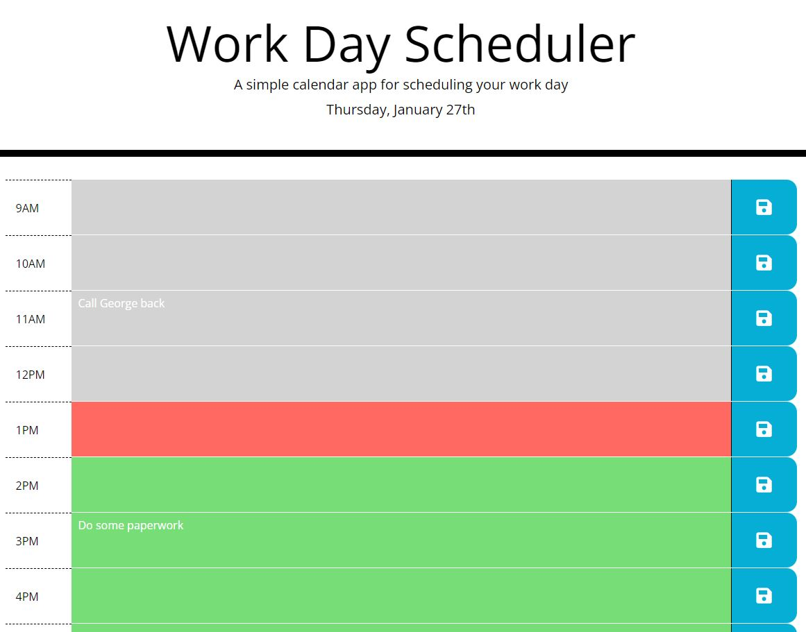

# Work Day Scheduler

## Description
The work day scheduler is a simple calendar app that allows you to timeblock your day. It displays a 9AM - 5PM view of the current day, and color codes past, present and future hours to help you coordinate tasks.

## Usage
Visit the live site at the following URL: 
<a href="https://jonmooney.github.io/work-day-scheduler/" title="CTRL+Click to open in a new window">https://jonmooney.github.io/work-day-scheduler/</a> 

- Hours are color coded for your convenience
- Click on a time slot and you can edit your task. Once done, click the save button
- Tasks are saved into memory (localStorage)

## Screenshot

## Features
- HTML
- CSS
- JavaScript, jQuery
- Functions, event listeners
- DOM manipulation
- Moment.js
- Git/GitHub

## Credits
Project HTML and CSS backbone provided by UC Davis Coding Bootcamp. JavaScript by Jon Mooney